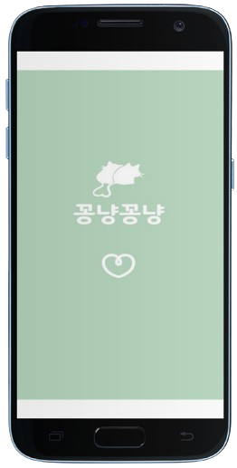
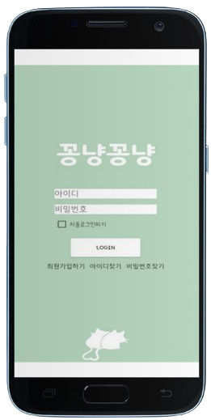
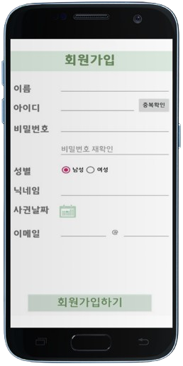
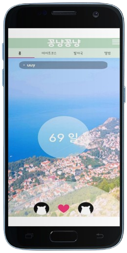
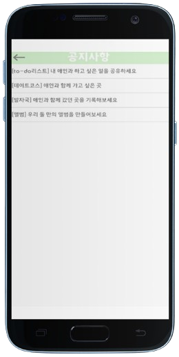
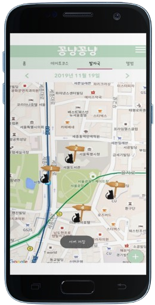
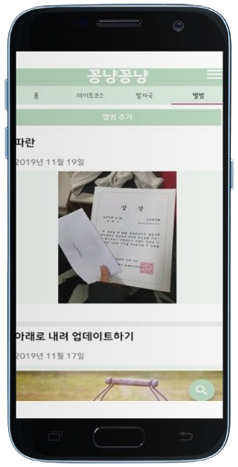

# 소중한 사람과의 추억을 기록하는 폐쇄형 SNS

> 🏆 졸업작품 전시회 장려상

 

### 프로젝트 개발 기간

`2019.03.` ~ `2019.11.` (9개월)

 

### 목차

- [기술 스택](#-기술-스택)
- [기능 설명](#-기능-설명)
- [실행 화면](#-실행-화면)
- [산출물](#-산출물)
    + [ERD](#erd)
    + [화면 흐름도](#화면-흐름도)
- [팀원 소개](#-팀원-소개)

  

# 📌 기술 스택

### Language

    
    

### Database

    
    

### API

    

### IDE

    

### VCS

    
    
    

### Tools

    

### Library

- [Retrofit2](https://github.com/square/retrofit)
- [Glide](https://github.com/bumptech/glide)
- [Gson](https://github.com/google/gson)
- [Lottie](https://lottiefiles.com)

 

# 📌 기능 설명

### 📝 To-Do 리스트

- 상대방과 함께 하고 싶은 일을 실시간으로 기록하고 공유

### 🔎 데이트 코스 추천

- 다양한 데이트 코스를 테마 별로 추천받고, 장소에 대한 정보 및 리뷰를 확인

### 🐾 발자국

- 데이트를 했던 장소를 지도에 마커를 생성하여 기록

### 🖼 앨범

- 사진을 올리고 글을 남겨 추억을 공유

 

# 📌 실행 화면

| 스플래시 | 로그인 | 회원가입 | 메인 |
| :---: | :---: | :---: | :---: |
|  |  |  |  |

| 메뉴 | 정보 수정 | 공지사항 | 메인화면 설정 |
| :---: | :---: | :---: | :---: |
|  |  |  |  |

| 할 일 | 데이트 코스 추천 | 발자국 | 앨범 |
| :---: | :---: | :---: | :---: |
|  |  |  |  |

 

# 📌 산출물

### ERD

### 화면 흐름도

|  |  |
| -------------------------------------------- | -------------------------------------------- |
|  |  |

 

# 📌 팀원 소개

|                                             조환희                                             |                                                서한별                                                |                                              연주원                                              |                                                한민지                                                |
| :--------------------------------------------------------------------------------------------: | :--------------------------------------------------------------------------------------------------: | :----------------------------------------------------------------------------------------------: | :--------------------------------------------------------------------------------------------------: |
|  |  |  |  |
|                               팀장 데이트 코스 추천 기능                                 |                                    PM 발자국 기능 최종 발표                                    |                                      앨범 기능 중간 발표                                      |                            메인 화면 계획 공유 기능 로고 디자인                             |
